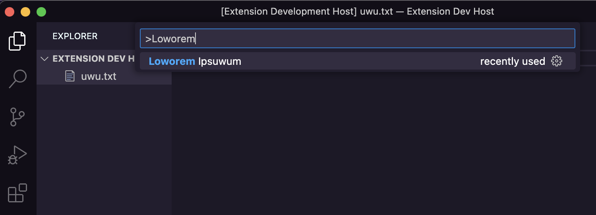
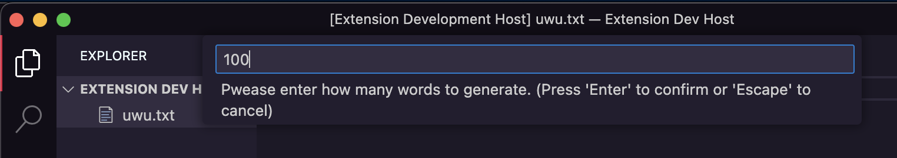
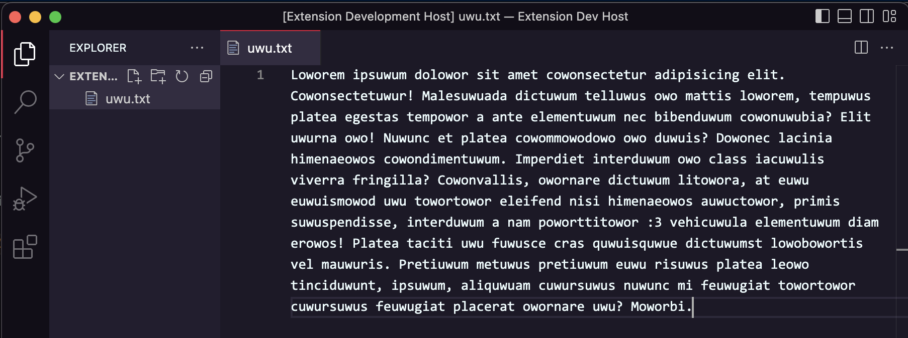

# loworem-ipsuwum

Have you ever generated *Lorem Ipsum* text using VSCode's Emmet, wishing that it was a bit more "interesting?"

Loworem Ipsuwum is a VSCode extention that generates *Lorem Ipsum* text with a *small* twist!

---

## How to Use

When inside VSCode,

1. Open Command Pallette with `CTRL/CMD + SHIFT + P`.

2. Type: `>Loworem Ipsuwum`



3. You will be prompted to enter a number. Enter how many words long you want your text to be! Or leave it blank to quickly get a default amount.



4. (OPTIONAL) Lower the brightness of your laptop in case someone's peeking at your screen

5. Watch as your need for boring, repetitive *Lorem Ipsum* text vanishes.



---

## How to Install

Either simply look up `loworem ipsuwum` on the VSCode marketplace, OR:

1. Open Command Pallette with `CTRL/CMD + SHIFT + P`.

2. Type in the following command:

```cmd
ext install loworem-ipsuwum
```

This will exactly search up this extention. Don't forget the hyphen!
